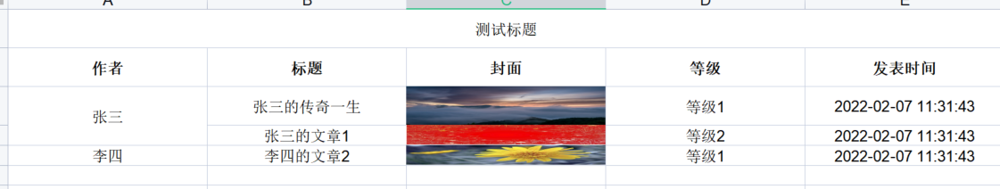

## 说明

本项目用于excel生成与导出，依赖poi和hutool

可以写出到文件，可以导出到流(如HttpServletResponse)

The project is an excel util for java, which can generates excel by some config, also supports export to stream.

<p align="center">
	<a target="_blank" href="https://search.maven.org/artifact/wang.joye/excel-util">
		
	</a>
	<a target="_blank" href="https://license.coscl.org.cn/MulanPSL2/">
		
	</a>
	<a target="_blank" href="https://www.oracle.com/java/technologies/javase/javase-jdk8-downloads.html">
		
	</a>
	<a target="_blank" href='https://github.com/joye-wang/excel-util'>
		
	</a>
</p>

## 添加依赖

```xml

<dependency>
    <groupId>wang.joye</groupId>
    <artifactId>excel-util</artifactId>
    <version>${latest.version}</version>
</dependency>
```

注意，其中的latest.version为最新版本
<a target="_blank" href="https://search.maven.org/artifact/wang.joye/excel-util">

</a>

## 配置

在使用之前需要自己编写配置，说明一个实体类应该如何导出为excel 配置是一个json数组

### 示例

```json
[
  {
    "name": "这里填配置名",
    "remark": "备注，此字段仅作注释使用",
    "fields": [
      {
        "name": "属性名称",
        "type": "属性类型",
        "title": "对应的excel列名",
        "mergeRepeatRow": "有相同行时，是否合并单元格",
        "valueMap": {
          "这里是key": "这里是value"
        }
      }
    ]
  }
]
```

### name

代表配置名，根据情况可以使用不同的配置

### remark

没有作用，仅作注释

### fields

配置的详细信息，对应类中每个字段的配置

### fields.name

类的属性名/字段名称

### fields.type

属性类型 目前支持类型如下

```
- string
普通文本，支持文字、小数

- imageUrl
网络图片，会自动下载图片并放到单元格上

- base64Image
base64图片

- localImage
本地图片

- date
日期，如2020-01-01

- datetime
日期和时间，如2020-01-01 12:00:00

- map
通过key自动转换为对应的value，具体请看示例
```

### fields.title

此属性对应的excel列名

### fields.mergeRepeatRow

只能填写true或false

有重复数据时，是否合并相同行的单元格

比如一个订单内有多个商品，而订单编号需要合并单元格，则将订单编号列的属性设置为true，详情可看可图示例（合并了相同的作者）

### fields.title

此属性对应的excel列名

### fields.valueMap

当属性类型为map时，通过此项配置指定如何映射原始字段，详细看下文

### 使用示例

```java
import lombok.Data;

import java.time.LocalDateTime;

/**
 * 文章类
 */
@Data
public class Post {
    private String author;
    private String coverBase64;
    private Integer level;
    private LocalDateTime publishTime;
    private String title;
}
```

```json
[
  {
    "name": "post",
    "remark": "这个示例的配置名为post",
    "fields": [
      {
        "name": "author",
        "type": "string",
        "title": "作者",
        "mergeRepeatRow": "true"
      },
      {
        "name": "coverBase64",
        "type": "base64",
        "title": "封面"
      },
      {
        "name": "level",
        "type": "map",
        "title": "等级",
        "valueMap": {
          "1": "一级",
          "2": "二级"
        }
      },
      {
        "name": "publishTime",
        "type": "datetime",
        "title": "发表时间"
      },
      {
        "name": "title",
        "type": "string",
        "title": "标题"
      }
    ]
  }
]
```

```
// 将上面的json字符串转成列表
List<BeanToExcelConfig> configs = ....
// 任意添加Post类用来生成excel
List<Post> list = ...

// 初始化配置，必须初始化
ExcelGenerateUtil.initConfig(configs);
// 生成excel文件
File file = ExcelGenerateUtil.generateFile(list, "post", "测试标题");
// 打印文件路径，根据此路径打印文件
System.out.println(file.getAbsolutePath());
```



## License

[Mulan](LICENSE) © joye-wang